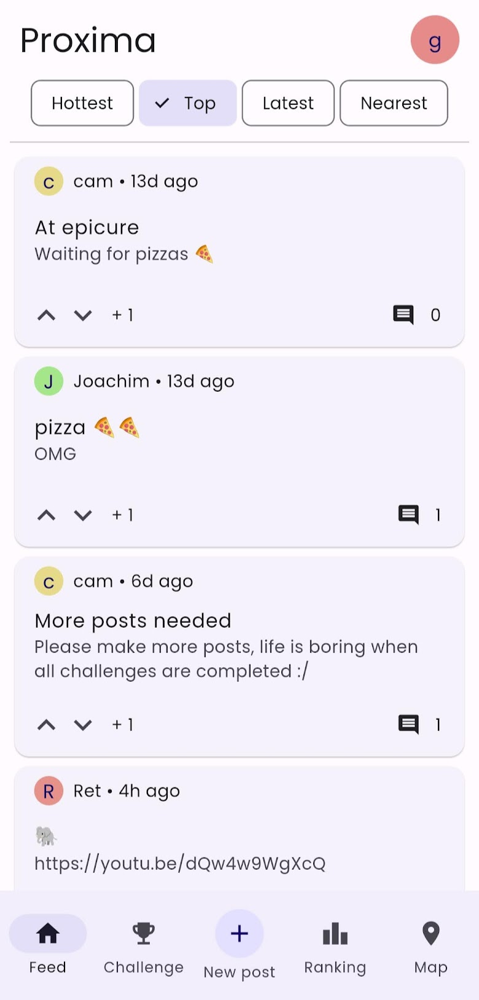
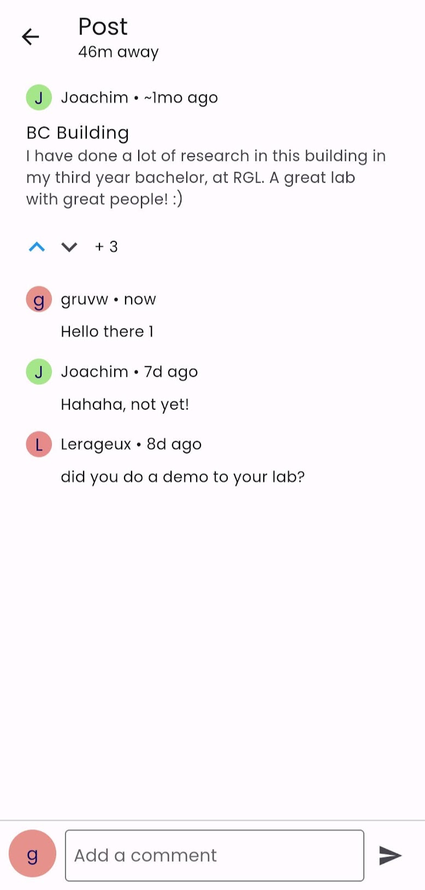
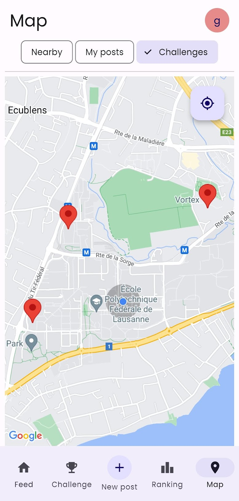
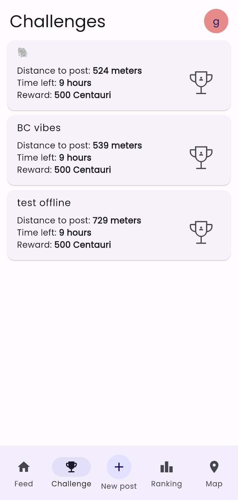
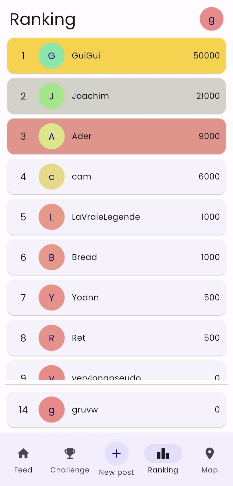
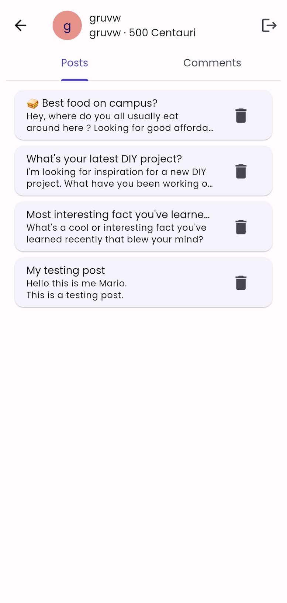
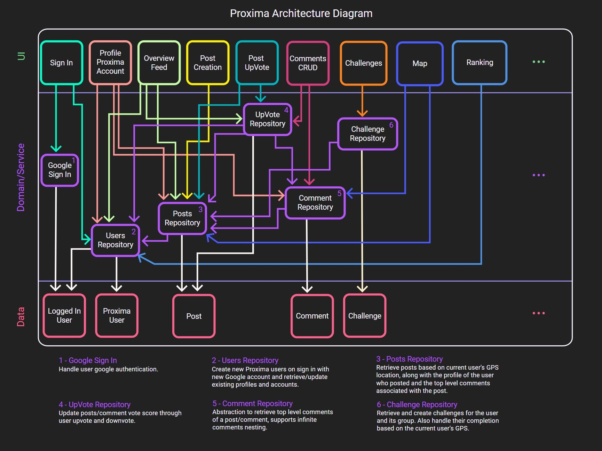

 

# Proxima

**Discover the world, one post at a time!**

Although people get closer through social media, they are physically farther than ever, so we
present you Proxima.

Imagine a social network where every post becomes a destination, encouraging you to step out and
explore.
It is not just about scrolling through life, it's about living it, one post at a time.
It allows people to share posts, but with a catch: one has to physically move to the place the post
was published in order to read it.

Please check out the Product Requirements Document (PRD) for more details about the
application: [Proxima PRD](docs/proxima_prd.pdf).

**Note**: you can also check out the original project
proposal: [Proxima Project Proposal](docs/proxima_project_proposal.pdf).

## Core Functionality

- **Split App Model**: Utilizes Google Firebase for storing and retrieving posts and comments,
  ensuring content is up-to-date and accessible.
- **User Support**: Requires account creation for posting (Google Sign-In), promoting a secure and
  personalized user experience.
- **Sensor Use**: Integrates GPS tracking to display posts within 100m of the user's current
  location, making content relevant and localized.
- **Offline Mode**: Caches posts for offline access, allowing users to view nearby content without
  an internet connection.

## Application

Here are a few screenshots of the main screens of the application:

     
    

**Note**: you can also check out the video presentation of the
app: [Proxima Video Presentation](https://www.youtube.com/watch?v=831yjtsBgHM).

## Technical Details

### User Interface Design

Link to
the [Mockup](https://design.penpot.app/#/view/ee63301e-1fa7-81b1-8004-5bee937a6d84?page-id=76cd5706-e69f-8069-8004-1a1578d3f0c7&section=interactions&index=41&share-id=271c9855-ceb4-8079-8004-6c8525144113) (
view mode only).

Link to
the [Wireframe](https://design.penpot.app/#/view/ee63301e-1fa7-81b1-8004-5bee937a6d84?page-id=93d0ad32-dfe5-8194-8004-0171998eeabf&section=interactions&index=17&share-id=064214a4-70ce-8065-8004-6c855a546150) (
view mode only).

Link to
the [Penpot Project](https://design.penpot.app/#/workspace/43442e9d-d45f-8169-8004-017078780238/ee63301e-1fa7-81b1-8004-5bee937a6d84?page-id=93d0ad32-dfe5-8194-8004-0171998eeabf).

### Project Architecture Diagram

This should give a quick reference/overview on the overall architecture and the relations between
the different screens, data sources, and internal state of the application.

## Contributors

- Joachim Favre ([@JoachimFavre](https://github.com/JoachimFavre))
- Lucas Jung ([@gruvw](https://github.com/gruvw))
- Yoann Lafore ([@yoannLafore](https://github.com/yoannLafore))
- Camille Lannoye ([@camillelnne](https://github.com/camillelnne))
- Alberts Reisons ([@Aderfish](https://github.com/Aderfish))
- Quentin Sandoz  ([@TheTexanCodeur](https://github.com/TheTexanCodeur))
- Guillaume Vitalis ([@CHOOSEIT](https://github.com/CHOOSEIT))
